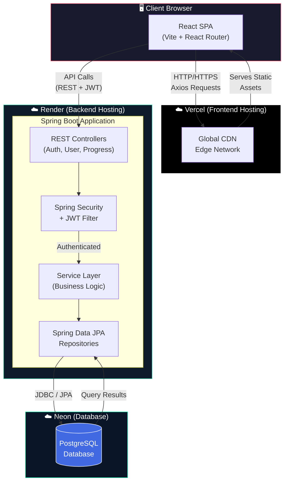
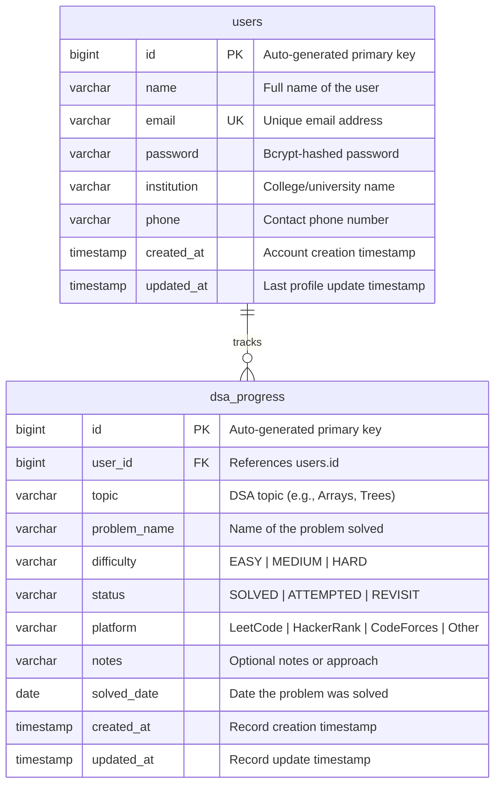

<div align="center">

# 🎯 SkillForge

**A Full-Stack Placement-Focused Student Dashboard**

[](https://github.com/yourusername/skillforge)
[](LICENSE)
[](https://openjdk.org/)
[](https://react.dev/)
[](https://spring.io/projects/spring-boot)
[](https://www.postgresql.org/)
[](https://vercel.com/)
[](https://render.com/)

</div>

---

## 📖 Overview

**SkillForge** is a modern, full-stack web application designed to empower students preparing for technical placements. It provides a personalized dashboard where users can track their progress across Data Structures & Algorithms (DSA) topics, monitor daily problem-solving streaks, and visualize their preparation journey through interactive charts and analytics. The platform is built with a focus on clean UX, secure authentication, and real-time progress insights.

The application follows a decoupled architecture with a **React.js** single-page application on the frontend communicating with a **Spring Boot** REST API on the backend. User data — including profiles, authentication credentials, and granular DSA progress records — is persisted in a **PostgreSQL** database. Security is handled via **JWT (JSON Web Tokens)**, ensuring stateless, scalable authentication across all protected endpoints.

SkillForge is production-deployed using a modern JAMstack-inspired pipeline: the frontend is hosted on **Vercel** for instant global edge delivery, the backend runs as a containerized service on **Render**, and the database is managed through **Neon** — a serverless PostgreSQL platform optimized for developer workflows. This architecture ensures high availability, seamless CI/CD, and minimal operational overhead.

---

## 🏗️ Architecture



---

## 🛠️ Tech Stack

### Frontend

| Technology | Purpose | Version |
|---|---|---|
| **React.js** | UI component library | 18.x |
| **Vite** | Build tool & dev server | 5.x |
| **React Router** | Client-side routing | 6.x |
| **Axios** | HTTP client for API calls | 1.x |
| **Recharts** | Data visualization & charts | 2.x |
| **CSS Modules** | Scoped component styling | — |

### Backend

| Technology | Purpose | Version |
|---|---|---|
| **Spring Boot** | Application framework | 3.x |
| **Spring Security** | Authentication & authorization | 6.x |
| **JWT (jjwt)** | Stateless token authentication | 0.12.x |
| **Spring Data JPA** | ORM & database access | 3.x |
| **Maven** | Build & dependency management | 3.9+ |
| **Java** | Runtime language | 17 |

### Infrastructure

| Technology | Purpose |
|---|---|
| **PostgreSQL** | Relational database |
| **Neon** | Serverless PostgreSQL (production) |
| **Vercel** | Frontend deployment & CDN |
| **Render** | Backend deployment & hosting |

---

## ✅ Features

- ✅ **Secure Authentication** — JWT-based register/login with bcrypt password hashing
- ✅ **User Profiles** — Editable student profiles with institution & contact details
- ✅ **DSA Progress Tracking** — Log solved problems across topics with status tracking
- ✅ **Interactive Dashboard** — Visual analytics with Recharts (pie, bar, line charts)
- ✅ **Progress Summary** — Aggregated stats: total solved, topic-wise breakdown, streaks
- ✅ **CRUD Operations** — Full create, read, update, delete on progress entries
- ✅ **Responsive Design** — Mobile-first CSS Modules with clean, modern UI
- ✅ **Protected Routes** — React Router guards + Spring Security endpoint protection
- ✅ **CORS Configuration** — Secure cross-origin setup for decoupled deployment
- ✅ **Production-Ready** — Deployed on Vercel + Render + Neon with environment-based configs

---

## 🗄️ Database Schema



---

## 📡 API Documentation

> **Base URL:** `http://localhost:8080` (development) or your Render deployment URL (production)

### Authentication Endpoints

#### `POST /api/auth/register`

Register a new user account.

| Property | Value |
|---|---|
| **Auth Required** | ❌ No |

**Request Body:**
```json
{
  "name": "Vishal Kumar",
  "email": "vishal@example.com",
  "password": "SecureP@ss123"
}
```

**Response** `201 Created`:
```json
{
  "id": 1,
  "name": "Vishal Kumar",
  "email": "vishal@example.com",
  "message": "User registered successfully"
}
```

---

#### `POST /api/auth/login`

Authenticate and receive a JWT token.

| Property | Value |
|---|---|
| **Auth Required** | ❌ No |

**Request Body:**
```json
{
  "email": "vishal@example.com",
  "password": "SecureP@ss123"
}
```

**Response** `200 OK`:
```json
{
  "token": "eyJhbGciOiJIUzI1NiIsInR5cCI6IkpXVCJ9...",
  "type": "Bearer",
  "email": "vishal@example.com",
  "name": "Vishal Kumar"
}
```

---

### User Endpoints

#### `GET /api/user/profile`

Retrieve the authenticated user's profile.

| Property | Value |
|---|---|
| **Auth Required** | ✅ Yes — `Bearer <token>` |

**Response** `200 OK`:
```json
{
  "id": 1,
  "name": "Vishal Kumar",
  "email": "vishal@example.com",
  "institution": "IIT Delhi",
  "phone": "+91-9876543210",
  "createdAt": "2026-01-15T10:30:00"
}
```

---

#### `PUT /api/user/profile`

Update the authenticated user's profile.

| Property | Value |
|---|---|
| **Auth Required** | ✅ Yes — `Bearer <token>` |

**Request Body:**
```json
{
  "name": "Vishal Kumar",
  "institution": "IIT Delhi",
  "phone": "+91-9876543210"
}
```

**Response** `200 OK`:
```json
{
  "id": 1,
  "name": "Vishal Kumar",
  "email": "vishal@example.com",
  "institution": "IIT Delhi",
  "phone": "+91-9876543210",
  "updatedAt": "2026-06-15T12:00:00"
}
```

---

### Progress Endpoints

#### `POST /api/progress`

Add a new DSA progress entry.

| Property | Value |
|---|---|
| **Auth Required** | ✅ Yes — `Bearer <token>` |

**Request Body:**
```json
{
  "topic": "Arrays",
  "problemName": "Two Sum",
  "difficulty": "EASY",
  "status": "SOLVED",
  "platform": "LeetCode",
  "notes": "Used HashMap for O(n) solution",
  "solvedDate": "2026-06-15"
}
```

**Response** `201 Created`:
```json
{
  "id": 1,
  "topic": "Arrays",
  "problemName": "Two Sum",
  "difficulty": "EASY",
  "status": "SOLVED",
  "platform": "LeetCode",
  "notes": "Used HashMap for O(n) solution",
  "solvedDate": "2026-06-15",
  "createdAt": "2026-06-15T14:30:00"
}
```

---

#### `GET /api/progress`

Retrieve all progress entries for the authenticated user.

| Property | Value |
|---|---|
| **Auth Required** | ✅ Yes — `Bearer <token>` |

**Response** `200 OK`:
```json
[
  {
    "id": 1,
    "topic": "Arrays",
    "problemName": "Two Sum",
    "difficulty": "EASY",
    "status": "SOLVED",
    "platform": "LeetCode",
    "notes": "Used HashMap for O(n) solution",
    "solvedDate": "2026-06-15",
    "createdAt": "2026-06-15T14:30:00"
  },
  {
    "id": 2,
    "topic": "Trees",
    "problemName": "Binary Tree Inorder Traversal",
    "difficulty": "MEDIUM",
    "status": "SOLVED",
    "platform": "LeetCode",
    "notes": "Recursive and iterative approaches",
    "solvedDate": "2026-06-14",
    "createdAt": "2026-06-14T09:15:00"
  }
]
```

---

#### `GET /api/progress/summary`

Get an aggregated dashboard summary of the user's progress.

| Property | Value |
|---|---|
| **Auth Required** | ✅ Yes — `Bearer <token>` |

**Response** `200 OK`:
```json
{
  "totalSolved": 42,
  "totalAttempted": 5,
  "totalRevisit": 3,
  "topicWise": {
    "Arrays": 12,
    "Trees": 8,
    "Dynamic Programming": 6,
    "Graphs": 5,
    "Strings": 4,
    "Linked Lists": 4,
    "Stacks & Queues": 3
  },
  "difficultyWise": {
    "EASY": 18,
    "MEDIUM": 20,
    "HARD": 4
  },
  "platformWise": {
    "LeetCode": 35,
    "HackerRank": 5,
    "CodeForces": 2
  },
  "currentStreak": 7,
  "longestStreak": 15,
  "lastSolvedDate": "2026-06-15"
}
```

---

#### `PUT /api/progress/{id}`

Update an existing progress entry.

| Property | Value |
|---|---|
| **Auth Required** | ✅ Yes — `Bearer <token>` |

**Request Body:**
```json
{
  "topic": "Arrays",
  "problemName": "Two Sum",
  "difficulty": "EASY",
  "status": "SOLVED",
  "platform": "LeetCode",
  "notes": "Optimized with HashMap - O(n) time, O(n) space",
  "solvedDate": "2026-06-15"
}
```

**Response** `200 OK`:
```json
{
  "id": 1,
  "topic": "Arrays",
  "problemName": "Two Sum",
  "difficulty": "EASY",
  "status": "SOLVED",
  "platform": "LeetCode",
  "notes": "Optimized with HashMap - O(n) time, O(n) space",
  "solvedDate": "2026-06-15",
  "updatedAt": "2026-06-15T16:00:00"
}
```

---

#### `DELETE /api/progress/{id}`

Delete a progress entry.

| Property | Value |
|---|---|
| **Auth Required** | ✅ Yes — `Bearer <token>` |

**Response** `204 No Content` *(empty body)*

---

### API Quick Reference

| Method | Endpoint | Description | Auth |
|---|---|---|---|
| `POST` | `/api/auth/register` | Register a new user | ❌ |
| `POST` | `/api/auth/login` | Login & get JWT token | ❌ |
| `GET` | `/api/user/profile` | Get user profile | ✅ |
| `PUT` | `/api/user/profile` | Update user profile | ✅ |
| `POST` | `/api/progress` | Add progress entry | ✅ |
| `GET` | `/api/progress` | Get all progress entries | ✅ |
| `GET` | `/api/progress/summary` | Get dashboard summary | ✅ |
| `PUT` | `/api/progress/{id}` | Update progress entry | ✅ |
| `DELETE` | `/api/progress/{id}` | Delete progress entry | ✅ |

---

## 🚀 Installation & Setup

### Prerequisites

| Tool | Version | Download |
|---|---|---|
| **Java JDK** | 17+ | [adoptium.net](https://adoptium.net/) |
| **Node.js** | 18+ | [nodejs.org](https://nodejs.org/) |
| **Maven** | 3.9+ | [maven.apache.org](https://maven.apache.org/) *(or use included mvnw)* |
| **PostgreSQL** | 15+ | [postgresql.org](https://www.postgresql.org/) |
| **Git** | Latest | [git-scm.com](https://git-scm.com/) |

### 1. Clone the Repository

```bash
git clone https://github.com/yourusername/skillforge.git
cd skillforge
```

### 2. Database Setup

Create a PostgreSQL database for local development:

```sql
-- Connect to PostgreSQL
psql -U postgres

-- Create the database
CREATE DATABASE skillforge;

-- Verify
\l
```

> [!TIP]
> For production, use [Neon](https://neon.tech/) — a serverless PostgreSQL service. See the [Deployment Guide](docs/deployment-guide.md) for details.

### 3. Backend Setup

```bash
# Navigate to backend directory
cd skillforge-backend

# Copy environment template
cp .env.example .env

# Edit .env with your database credentials
# Then run the application
./mvnw spring-boot:run
```

The backend will start on `http://localhost:8080`. Spring Data JPA will auto-create the database tables on first run (via `spring.jpa.hibernate.ddl-auto=update`).

> [!NOTE]
> On Windows, use `mvnw.cmd` instead of `./mvnw`.

### 4. Frontend Setup

```bash
# Navigate to frontend directory (from project root)
cd skillforge-frontend

# Copy environment template
cp .env.example .env

# Install dependencies
npm install

# Start development server
npm run dev
```

The frontend will start on `http://localhost:5173`.

### 5. Verify Setup

1. Open `http://localhost:5173` in your browser
2. Register a new account
3. Login with your credentials
4. Start tracking your DSA progress!

---

## 🔐 Environment Variables

### Backend (`skillforge-backend/.env`)

| Variable | Description | Example |
|---|---|---|
| `DATABASE_URL` | JDBC PostgreSQL connection string | `jdbc:postgresql://localhost:5432/skillforge` |
| `DATABASE_USERNAME` | Database user | `postgres` |
| `DATABASE_PASSWORD` | Database password | `password` |
| `JWT_SECRET` | Secret key for JWT signing (min 256-bit) | `my-super-secret-jwt-key-that-is-long-enough` |
| `CORS_ORIGINS` | Allowed frontend origins (comma-separated) | `http://localhost:5173` |

### Frontend (`skillforge-frontend/.env`)

| Variable | Description | Example |
|---|---|---|
| `VITE_API_URL` | Backend API base URL | `http://localhost:8080` |

> [!IMPORTANT]
> Never commit `.env` files to version control. Use `.env.example` files as templates.

---

## ☁️ Deployment

SkillForge uses a three-tier deployment strategy:

| Service | Platform | Purpose |
|---|---|---|
| Frontend | **Vercel** | Static site hosting with global CDN |
| Backend | **Render** | Managed Java application hosting |
| Database | **Neon** | Serverless PostgreSQL |

For detailed step-by-step deployment instructions, see the **[Deployment Guide](docs/deployment-guide.md)**.

---

## 📁 Project Structure

```
skillforge/
├── skillforge-backend/                # Spring Boot Backend
│   ├── src/
│   │   ├── main/
│   │   │   ├── java/com/skillforge/
│   │   │   │   ├── config/
│   │   │   │   │   ├── SecurityConfig.java
│   │   │   │   │   ├── JwtAuthFilter.java
│   │   │   │   │   ├── JwtUtil.java
│   │   │   │   │   └── CorsConfig.java
│   │   │   │   ├── controller/
│   │   │   │   │   ├── AuthController.java
│   │   │   │   │   ├── UserController.java
│   │   │   │   │   └── ProgressController.java
│   │   │   │   ├── model/
│   │   │   │   │   ├── User.java
│   │   │   │   │   └── DsaProgress.java
│   │   │   │   ├── dto/
│   │   │   │   │   ├── RegisterRequest.java
│   │   │   │   │   ├── LoginRequest.java
│   │   │   │   │   ├── LoginResponse.java
│   │   │   │   │   ├── ProfileUpdateRequest.java
│   │   │   │   │   └── ProgressRequest.java
│   │   │   │   ├── repository/
│   │   │   │   │   ├── UserRepository.java
│   │   │   │   │   └── DsaProgressRepository.java
│   │   │   │   ├── service/
│   │   │   │   │   ├── AuthService.java
│   │   │   │   │   ├── UserService.java
│   │   │   │   │   └── ProgressService.java
│   │   │   │   └── SkillforgeApplication.java
│   │   │   └── resources/
│   │   │       └── application.properties
│   │   └── test/
│   │       └── java/com/skillforge/
│   ├── .env.example
│   ├── mvnw
│   ├── mvnw.cmd
│   └── pom.xml
│
├── skillforge-frontend/               # React Frontend
│   ├── public/
│   │   └── favicon.ico
│   ├── src/
│   │   ├── assets/
│   │   │   └── logo.svg
│   │   ├── components/
│   │   │   ├── Navbar/
│   │   │   │   ├── Navbar.jsx
│   │   │   │   └── Navbar.module.css
│   │   │   ├── Dashboard/
│   │   │   │   ├── Dashboard.jsx
│   │   │   │   └── Dashboard.module.css
│   │   │   ├── ProgressForm/
│   │   │   │   ├── ProgressForm.jsx
│   │   │   │   └── ProgressForm.module.css
│   │   │   ├── ProgressTable/
│   │   │   │   ├── ProgressTable.jsx
│   │   │   │   └── ProgressTable.module.css
│   │   │   └── Charts/
│   │   │       ├── TopicChart.jsx
│   │   │       ├── DifficultyChart.jsx
│   │   │       └── Charts.module.css
│   │   ├── pages/
│   │   │   ├── Login.jsx
│   │   │   ├── Register.jsx
│   │   │   ├── Home.jsx
│   │   │   └── Profile.jsx
│   │   ├── services/
│   │   │   └── api.js
│   │   ├── context/
│   │   │   └── AuthContext.jsx
│   │   ├── hooks/
│   │   │   └── useAuth.js
│   │   ├── App.jsx
│   │   ├── App.module.css
│   │   ├── main.jsx
│   │   └── index.css
│   ├── .env.example
│   ├── index.html
│   ├── package.json
│   └── vite.config.js
│
├── docs/
│   ├── deployment-guide.md
│   └── postman-collection.json
├── .gitignore
├── LICENSE
└── README.md
```

---

## 🤝 Contributing

Contributions are welcome! Here's how to get started:

1. **Fork** the repository
2. **Create** a feature branch:
   ```bash
   git checkout -b feature/amazing-feature
   ```
3. **Commit** your changes with clear messages:
   ```bash
   git commit -m "feat: add topic-wise progress filtering"
   ```
4. **Push** to your branch:
   ```bash
   git push origin feature/amazing-feature
   ```
5. **Open** a Pull Request

### Commit Convention

This project follows [Conventional Commits](https://www.conventionalcommits.org/):

| Prefix | Usage |
|---|---|
| `feat:` | New feature |
| `fix:` | Bug fix |
| `docs:` | Documentation changes |
| `style:` | Code formatting (no logic change) |
| `refactor:` | Code restructuring |
| `test:` | Adding or updating tests |
| `chore:` | Build, CI, or tooling changes |

### Code of Conduct

Please be respectful and constructive. This project follows the [Contributor Covenant](https://www.contributor-covenant.org/) code of conduct.

---

## 📄 License

This project is licensed under the **MIT License** — see the [LICENSE](LICENSE) file for details.

```
MIT License

Copyright (c) 2026 SkillForge

Permission is hereby granted, free of charge, to any person obtaining a copy
of this software and associated documentation files (the "Software"), to deal
in the Software without restriction, including without limitation the rights
to use, copy, modify, merge, publish, distribute, sublicense, and/or sell
copies of the Software, and to permit persons to whom the Software is
furnished to do so, subject to the following conditions:

The above copyright notice and this permission notice shall be included in all
copies or substantial portions of the Software.

THE SOFTWARE IS PROVIDED "AS IS", WITHOUT WARRANTY OF ANY KIND, EXPRESS OR
IMPLIED, INCLUDING BUT NOT LIMITED TO THE WARRANTIES OF MERCHANTABILITY,
FITNESS FOR A PARTICULAR PURPOSE AND NONINFRINGEMENT. IN NO EVENT SHALL THE
AUTHORS OR COPYRIGHT HOLDERS BE LIABLE FOR ANY CLAIM, DAMAGES OR OTHER
LIABILITY, WHETHER IN AN ACTION OF CONTRACT, TORT OR OTHERWISE, ARISING FROM,
OUT OF OR IN CONNECTION WITH THE SOFTWARE OR THE USE OR OTHER DEALINGS IN THE
SOFTWARE.
```

---

<div align="center">

**Built with ❤️ for placement preparation**

[⬆ Back to Top](#-skillforge)

</div>
